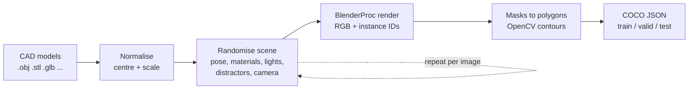

<div align="center">

# CAD2COCO

**Synthetic instance-segmentation datasets from CAD models, with zero manual labelling.**

Drop in CAD files → randomised scenes are rendered with BlenderProc → every part gets a pixel-accurate
polygon annotation in COCO format, split into `train / valid / test` and ready to train.


</div>

<sub>Walkthrough built with <code>scripts/demo/</code>. The renders in the GIF and in the example images below come
from a lightweight CPU preview renderer, so they could be produced without Blender. The annotations, splits and
statistics are real output of the COCO pipeline. See <a href="#reproduce-the-readme-visuals">Reproduce the README
visuals</a> to rebuild them from a BlenderProc run.</sub>

---

## Contents

- [Why](#why) · [Features](#features) · [How it works](#how-it-works) · [Example dataset](#example-dataset)
- [Installation](#installation) · [Usage](#usage) · [Output](#output) · [Training on it](#training-on-it)
- [Configuration](#configuration) · [Project structure](#project-structure) · [Development](#development)
- [Limitations and next steps](#limitations-and-next-steps)

## Why

Labelling segmentation masks for industrial parts is slow, and real photos of every part variant are hard to get.
If a CAD model exists, a renderer can produce thousands of varied, pixel-perfect labelled images in the time it takes
to label a handful by hand. CAD2COCO packages that workflow into a small, reproducible tool with a UI.

## Features

| | |
|---|---|
| **Any CAD mesh** | `.obj` `.stl` `.ply` `.glb` `.gltf` `.fbx`. Multi-part files are joined and every model is normalised (centred, longest side = 1 m), so mm / cm / inch exports all behave the same. |
| **Multi-class scenes** | Several parts per image; class names are editable in the UI and files sharing a name become one class. |
| **Domain randomisation** | Pose (random 6-DoF or rigid-body physics drop), material finish, procedural floors, world colour, 1–N coloured lights, occluding distractors, camera distance / elevation / FOV / roll, sensor noise, blur and JPEG quality. |
| **Correct occlusion** | Only target parts get an instance ID, so distractors cut into the masks exactly as they should. Hidden or tiny instances are dropped by a visible-pixel threshold. |
| **COCO polygons** | Outer contours, Douglas–Peucker simplified, split parts kept as multiple polygons, plus tight bbox and pixel area. |
| **Reproducible** | Seeded, and the full config is saved as YAML next to every dataset. |
| **Gradio app + CLI** | 3D preview, presets, live log, annotated gallery, per-class stats, dataset inspector. Or run it headless. |
| **Tested** | 29 tests that run without Blender (the renderer is faked), linted with ruff, CI on GitHub Actions. |

## How it works



**1. Load CAD.** Each model is centred and scaled, then placed at a chosen physical size.

<p align="center"></p>

**2. Randomise every image.** Parts, finishes, lights, floor, camera and clutter change per frame.

<p align="center"></p>

**3–4. Render and annotate.** Blender writes an RGB image plus an instance-ID pass in which only the target parts
have an ID. Each ID mask becomes COCO polygons. The distractor egg and the overlapping tees below show why the ID
pass matters: the occluded parts of each mask are cut away automatically.

<p align="center"></p>

Rendering and annotation are deliberately separated: Blender only writes images and raw instance maps, and the COCO
conversion runs in plain Python, so the geometry code is unit-testable without Blender.

## Example dataset

200 images of the three sample parts (flange, bracket, tee) with default settings: **533 annotated instances,
2.7 per image, ~23 polygon vertices per instance**.

<p align="center"></p>

<picture>
  <source media="(prefers-color-scheme: dark)" srcset="docs/images/dataset_stats_dark.png">
  
</picture>

Classes come out balanced because parts are drawn uniformly per instance. Most instances cover 2–6 % of the image,
which is typical for a multi-part scene seen from 0.45–1.0 m.

<picture>
  <source media="(prefers-color-scheme: dark)" srcset="docs/images/randomisation_dark.png">
  
</picture>

Camera viewpoints cover the configured distance and elevation ranges evenly, and finishes and backgrounds are
spread across all options, so no single appearance dominates the training set.

## Installation

```bash
git clone https://github.com/<your-username>/cad2coco.git
cd cad2coco
python -m venv .venv && source .venv/bin/activate   # Windows: .venv\Scripts\activate
pip install -e .
```

The first render downloads Blender automatically through BlenderProc (~300 MB). To use an existing install, set
`CAD2COCO_BLENDER_PATH=/path/to/blender`. A GPU is optional, but Cycles is much faster with one.

## Usage

### Gradio app

```bash
python app.py            # or: cad2coco ui
```

1. Upload one or more CAD models (add the `.mtl` and textures to keep original materials).
2. Rename classes in the table if needed.
3. Pick a preset (**Quick look** first, to check scale and framing), adjust randomisation, and click **Generate**.
4. Download the zip, or browse it in the **Inspect dataset** tab.

<p align="center">
  
  
</p>

Sample parts live in `examples/models/` (regenerate them with `python scripts/make_sample_models.py`).

### CLI

```bash
# 500 images of three classes, parts dropped onto the floor with physics
cad2coco generate examples/models/pipe_flange.obj examples/models/l_bracket.obj examples/models/pipe_tee.obj \
    --classes flange,bracket,tee -n 500 --physics

# reuse a saved config
cad2coco generate part.stl -c configs/default.yaml

# inspect the result
cad2coco stats runs/<run>/dataset
cad2coco preview runs/<run>/dataset --split valid -n 16
```

## Output

```
runs/<timestamp>_<name>/
├── config.yaml                  # exact settings used
├── job.json                     # what was sent to Blender
├── render/                      # raw renders: images/, masks/ (instance IDs), frames.jsonl
└── dataset/                     # ← train on this
    ├── cad2coco_config.yaml
    ├── train/  _annotations.coco.json + images
    ├── valid/  _annotations.coco.json + images
    └── test/   _annotations.coco.json + images
```

`render/frames.jsonl` also stores camera intrinsics, camera pose and each part's 6-DoF pose per image, so the same
renders can later be used for pose estimation.

## Training on it

**RF-DETR** reads this layout directly:

```python
from rfdetr import RFDETRSegMedium

model = RFDETRSegMedium()
model.train(dataset_dir="runs/<run>/dataset", epochs=50, batch_size=4)
```

**YOLO-seg** (Ultralytics): convert first with `ultralytics.data.converter.convert_coco(..., use_segments=True)`.
**Detectron2 / MMDetection**: register each split's `_annotations.coco.json` as a standard COCO dataset.

## Configuration

All settings live in `configs/default.yaml` and map one-to-one to the sliders in the app.

| Section | Key settings |
|---|---|
| `dataset` | `num_images`, `width`, `height`, `seed`, `valid_ratio`, `test_ratio` |
| `scene` | `instances_min/max`, `distractors_max`, `placement` (`free` / `physics`), `object_size` (m), `size_jitter`, `spread_radius`, `floor_probability` |
| `camera` | `dist_min/max` (m), `elev_min/max`, `fov_min/max`, `roll_max` (degrees) |
| `appearance` | `material_mode` (`random` / `original` / `mixed`), `lights_max`, `light_min/max`, `samples`, `noise_max`, `blur_prob` |
| `annotation` | `min_visible_px`, `polygon_tolerance`, `min_part_area` |

Rule of thumb: keep the camera distance at roughly 2–5× the part size. If renders come back empty, that ratio is
usually why.

## Project structure

```
cad2coco/
├── cad2coco/
│   ├── blender/render_scene.py   # BlenderProc job (runs inside Blender's Python)
│   ├── coco.py                   # masks → COCO polygons, splits, stats
│   ├── pipeline.py               # stage models, run Blender, export, zip
│   ├── config.py                 # settings dataclasses ⇄ YAML, presets
│   ├── visualize.py              # annotation overlays
│   ├── app.py                    # Gradio UI
│   └── cli.py                    # command line
├── configs/default.yaml
├── examples/models/              # sample CAD parts
├── scripts/demo/                 # GIF, charts and preview renderer for this README
└── tests/                        # runs without Blender
```

## Development

```bash
pip install -e ".[dev]"
ruff check .
pytest           # no Blender needed: the renderer is replaced by a fake that writes the same outputs
```

### Reproduce the README visuals

```bash
pip install -e ".[demo]" && playwright install chromium

# charts from any generated dataset
python scripts/demo/readme_charts.py --dataset-dir runs/<run>/dataset --render-dir runs/<run>/render --out docs/images

# record the running app, then build the walkthrough GIF + MP4
python app.py &
python scripts/demo/record_app.py --out captures
python scripts/demo/make_demo_gif.py \
    --render-dir runs/<run>/render --dataset-dir runs/<run>/dataset \
    --models examples/models/pipe_flange.obj examples/models/l_bracket.obj examples/models/pipe_tee.obj \
    --classes flange bracket tee --app-captures captures --out docs/demo
```

No Blender available? `python scripts/demo/preview_dataset.py --out demo_data -n 200` renders a dataset with the CPU
preview renderer and runs it through the real COCO conversion.

## Limitations and next steps

- COCO polygons can't represent holes, so a part seen through its own bore (a flange, a nut) is annotated by its
  outer contour. RLE output would fix this.
- Materials are procedural. CC0 PBR textures (ambientCG, Poly Haven) and HDRI lighting would narrow the sim-to-real
  gap further.
- Always validate on a small set of **real** labelled images. Synthetic pre-training followed by real fine-tuning is
  usually the strongest setup.

## Built with

[BlenderProc](https://github.com/DLR-RM/BlenderProc) · [Blender](https://www.blender.org/) ·
[Gradio](https://www.gradio.app/) · [OpenCV](https://opencv.org/) · [pycocotools](https://github.com/cocodataset/cocoapi) ·
[trimesh](https://trimesh.org/)

## License

MIT, see [LICENSE](LICENSE).
